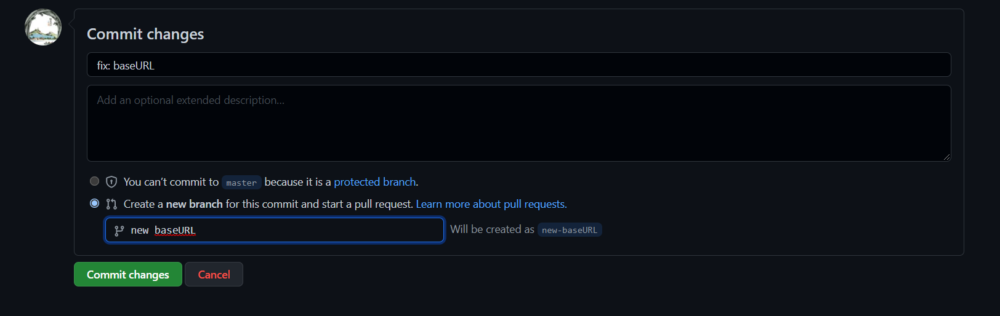
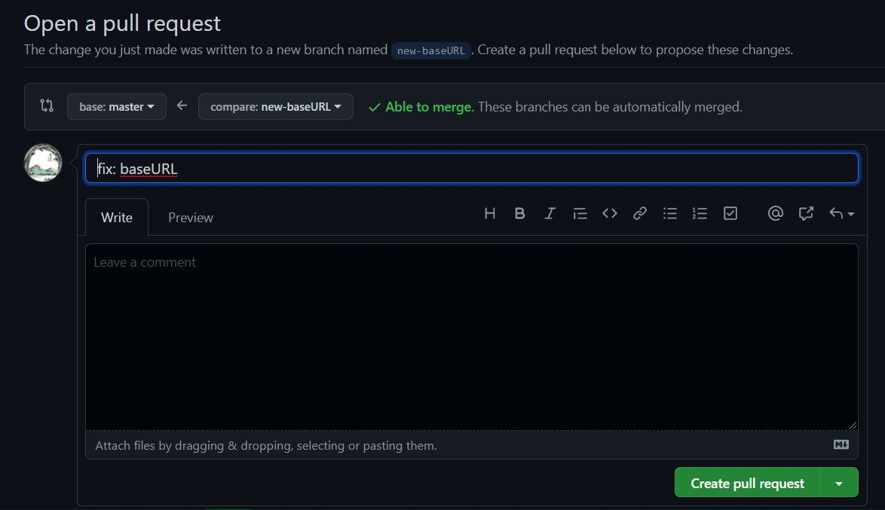

# Document-as-Code (DAC) Starting Template


The **DAC** (document-as-code) project is an initiative originated from the **NaaS AIOps** group at [TELUS](https://www.telus.com) to create easy-to-use code-free technical documentation sites within the organization. The **DAC** project is built upon [Hugo](https://gohugo.io/), which is one of the most popular open-source frameworks used for building static websites. This repository, to briefly put it, is an example website for the DAC project, which uses a [custom-made Hugo theme](https://github.com/andrewdhr/docsy-for-telus) to convert technical documents into websites and host them on [GitHub Pages](https://pages.github.com/). 

## Is it for me?
If your team at TELUS needs a **professional-looking** **internal** documentation site, and if the following aspects of the documentation website are crucial to you:

- Its UI/UX is similar to the documentation sites of other tech companies like [AWS](https://docs.aws.amazon.com/iam/?id=docs_gateway) or [GitHub](https://docs.github.com/en/rest), which includes

   - Easy site navigation and indexing of documents.
   - Local search within the website.
   - Code display and highlighting.
   - Multilingual support (English & French)
   - ...
- It should be easily set up with only a few clicks, and it does not require any knowledge in web development.
- I only need to focus on writing my documents in a **human-readable** format, such as MarkDown files or Google Docs, and this template should handle the rest for me in terms of:

   - **Automatically convert** my documents (MarkDown files or Google Docs) into websites (HTML files) without the need of running any code on my machine.
    - **Automatically build, index and deploy** the website with my documents on the internet. Zero maintenance for me. 

- The contents of the website should be stored with the **version tracking** system on GitHub, where it would be easy for my team to collaborate through Git commits and pull requests.
- The website should be hosted on a **secure** server on the **cloud**, and I have total control over who can access the website via **IAM**.
- I can take the website down or delete it altogether whenever I want. 
- The source code of any software used in this project should be **100% open-source**, and I could inspect its source code at any time for any reason.

then, congratulations! You have come to the right place! 

## What does this starting template entail?

This **Document-as-Code (DAC) Starting Template** is an example skeleton technical documentation website for you to use. Built in the name of an arbitrary **TELUS Awesome Team**, this [skeleton website](https://andrewdhr.github.io/dac-example/) shows you what your team’s documentation website would look like and how it may fit your team’s documentation needs. Just to be clear, the "Awesome Team" is not real here at TELUS. But just like them, you can also easily own this beautiful and centralized UI for hosting your team’s technical and work documents. 

**All you need to do is clone/copy this project and edit it with your own content.** Simply follow all the steps through the remaining sections of this README. In the end, you will find that it is actually very easy to use, and you are guaranteed to like your new, clean, and centralized technical documentation site which will be securely hosted on our [TELUS GitHub Enterprise Cloud](https://github.com/telus).

## Prerequisites
> NOTE: To avoid internet connectivity issues, please **always disconnect your corporate VPN first** when setting up or using the DAC project.

Assuming you are using the **Windows 10 Enterprise** on your TELUS laptop, the following are basic prerequisites for using the DAC starting template to build your own website:


1. Access to the TELUS GitHub Organization

   TELUS has an [organizational account](https://github.com/telus) on GitHub, which uses the GitHub Enterprise Cloud service. To use this DAC project to build your own documentation website, first, you need to enroll your GitHub account into the TELUS GitHub Organization. Access to the TELUS GitHub Organization is managed by the [SCM team](mailto:dlEnvMgmt-ConfigurationMgmtBC@telus.com).

   Please read this [FAQ page](https://sites.google.com/telus.com/github-devtools/github-faqs) written by the SCM team to enroll your GitHub account into the TELUS GitHub Organization. If you encounter any issues in your enrollment, please contact the SCM team directly. 


1. Windows Subsystem for Linux (WSL) 2

   This project itself is built to be a cross-platform tool. However, it has dependencies on certain [Node.js](https://nodejs.org/en/about/) packages that can be only rendered correctly on Linux. If you run the DAC project directly on Windows, it can result in build and runtime errors or unwanted behaviours. Therefore, to use the DAC project, you must first install **WSL 2**, which is a compatibility layer for running Linux binary executables natively, on your Windows machine.

   To learn more about WSL 2 and install its latest version, please refer to the [Microsoft WSL Documentation Webiste](https://docs.microsoft.com/en-us/windows/wsl/). 

   > NOTE: You can try this [maunal installation guide](https://docs.microsoft.com/en-us/windows/wsl/install-manual) if you run into issues when using the `wsl --install` command to install WSL 2 as indicted in Microsoft's default installation guide.

   To check if your WSL 2 has been installed successfully on your Windows machine, open your Windows **command prompt** and run:

   ```bash
   wsl -l -v
   ```
   and you should get a result like this:

   ```bash
    NAME            STATE           VERSION
   *Ubuntu-xx.xx    Running         2
   ```
    where the "xx.xx" is the version number of the latest Ubuntu you just installed.

   Once the process of installing your Linux distribution with WSL is complete, open the distribution (Ubuntu) using the Windows **Start** menu. As a first-time user, you also need to [set up your Linux username and password](https://docs.microsoft.com/en-us/windows/wsl/setup/environment#set-up-your-linux-username-and-password).

   > NOTE: WSL and Windows have two separate file systems and misusing them could give you problems with performance speed or compatibility. Regarding this issue, one key principle you need to keep in mind is that **you should always store and run your project files on the same operating system as the project is built upon**. 
   
   As mentioned above, this project uses external programs that have Linux-specific dependencies, and it is intended to be only used on your WSL. Therefore, **from this point forward, you should always use your WSL (NOT Windows) when you go through the remaining sections of this guide** to install and set this project up. In the future, you should always run this project on your WSL as well.

1. Git

   Git packages are available via apt. Run the following command to install Git:
   ```bash
   $ sudo apt-get install git
   ```

   Verify the installation was successful by typing ```git --version```:
   ```bash
   $ git --version
   git version x.x.x
   ```

1. GitHub CLI

   You would need [GitHub CLI](https://cli.github.com/manual/) to authenticate to the TELUS GitHub Enterprise Server from your WSL. GitHub CLI can be easily installed via [Homebrew](https://brew.sh/), which is one of the most popular package manager for Linux or MacOS. 
   
   To install Homebrew, run:

   ```bash
   $ /bin/bash -c "$(curl -fsSL https://raw.githubusercontent.com/Homebrew/install/HEAD/install.sh)"
   ```

   Then, to install GitHub CLI, run:

   ```bash
   $ brew install gh
   ```

   Verify the installation was successful by typing ```gh --version```:

   ```bash
   $ gh --version
   gh version x.x.x (20xx-xx-xx)
   https://github.com/cli/cli/releases/tag/vx.x.x
   ```

1. Node.js and npm

   [npm](https://www.npmjs.com/) is the default package manager for the JavaScript runtime environment Node.js, which is used to build this project. 
   
   You need to install a number of dependencies before you can install Node.js and npm on your WSL:

   ```bash
   $ sudo apt-get install build-essential curl m4 ruby texinfo libbz2-dev libcurl4-openssl-dev libexpat-dev libncurses-dev zlib1g-dev
   ```

   Then, to install Node.js and npm, simply run:

   ```bash
   $ brew install node
   ```
   
   To verify the installation was successful:

   ```bash
   $ node -v
   vx.x.x
   $ npm -v
   x.x.x
   ```

1. Extended version of Hugo

   Your website would be built by [Hugo](https://gohugo.io/). The DAC project requires an **extended and recent** version of Hugo installed on your WSL.

   The following steps show you how to install Hugo from its [offical release page](https://github.com/gohugoio/hugo/releases):

   1. Create a new directory and switch to it:

      ```bash
      $ mkdir hugo
      $ cd hugo
      ```
   
   1. Go to the [offical release page](https://github.com/gohugoio/hugo/releases) of Hugo. You should be able to see a complete list of Linux installation options.

   1. In the most recent release, scroll down until you find a list of **Extended** versions.

   1. Download the latest extended version (e.g. hugo_extended_0.91.2_Linux-64bit.tar.gz).

      ```bash
      $ wget https://github.com/gohugoio/hugo/releases/download/v0.91.2/hugo_extended_0.91.2_Linux-64bit.tar.gz
      ```
   1. Install Hugo:
      ```bash
      $ tar -xf hugo_extended_0.91.2_Linux-64bit.tar.gz
      $ sudo install hugo /usr/bin 
      ```
   1. Verify installation
      ```bash
      $ hugo version
      hugo v0.91.2+extended linux/amd64 BuildDate=xxxxxx
      ```
      Make sure that you see the word **extended** and the Hugo version is 0.75.0 or later.


1. VSCode

   [Visual Studio Code](https://code.visualstudio.com/) would make it very easy for you to navigate project files and write your own content later on.

   To install VSCode on WSL, you need to install the latest version of [Visual Studio Code](https://code.visualstudio.com/) on the Windows side first.

   > Note: When prompted to Select Additional Tasks during installation, be sure to check the Add to PATH option so you can easily open a folder in WSL using the code command.

   Then, install the [Remote Development extension pack](https://marketplace.visualstudio.com/items?itemName=ms-vscode-remote.vscode-remote-extensionpack).

   To verify your installation, open your WSL and run:
      ```bash
      $ code .
      ```
   The VSCode GUI should be launched on your screen from WSL.

If you have successfully installed all the prerequisites listed above, then congratulations! The hardest part is now behind you and let's get started to build yourself your own technical documentation website.

## Getting Strted 
### Using this DAC Example Project as a template
> NOTE: Skip this section if someone in your team has already set up the repository.

As we have mentioned above, this project is a starting template to show you what your documentation website would look like. It has been properly configured so all you need to do is clone/copy this project and edit it with your own content. 
1. Make a copy of this project on GitHub.

   1. Click **Use this template** on the top of this page.
   

   1. Open the **Owner** drop-down menu. Choose **telus** with our purple logo in the list.
   
      > NOTE: You need to [sign in](https://docs.github.com/en/account-and-profile/setting-up-and-managing-your-github-user-account/managing-your-membership-in-organizations/accessing-an-organization) to the TELUS GitHub organization on GitHub first if you don't see that purple TELUS icon in your drop-down menu.

   1. Select a name for your new project, such as **your-team-name-docs**, and type it in the "Repository name" box.

   1. Choose the correct visibility for your project.
   
      > NOTE: If you would like your team's technical documentation website to be available to anyone on the Internet, choose **Public**. If you would like your team's website to be only accessible within TELUS (i.e all the TELUS employees (with a telus.com email) who have also been added to the TELUS GitHub organization.), choose **Internal**. If you need to restrict the access to your website to only a specific group of TELUS employees, such as the members of your team, choose **Private**.
   1. and click **Create repository from template**.
      
      After GitHub finishes creating a repository for you, you would be redirected to a new repository named like **telus/your-team-name-docs** which is inside the TELUS GitHub organization but belongs to you.

      You would also see a GitHub Action running (orange dot) called **Hugo CI**. 
      
      You could see its details in the **Actions** tab.
      
      For now, even if you get a failure warning for this action, you could ignore that at this step. The **Hugo CI** action is designed to automatically build the website for you every time you update this repository. Since we haven't set up a website yet, you can simply ignore this action at this step, and we will talk more about it later on.

      > NOTE: You may also receive a security warning regarding the "Retired HTTP preproduction username". You can ignore that as well. 


1. Add collaborators to your project

   In the previous step, we have configured the visibility, which means who will have the view access to your project, of your new **telus/your-team-name-docs** repository. Now, we need to configure who will be the project collaborators. Generally speaking, collaborators are the ones who have **write** access or **admin** privileges to your project. This is especially important if your project was set to be **private** in the previous step because your documentation website would be only visible to you (the owner) and the collaborators to this repository.

   Follow this [guide](https://docs.github.com/en/account-and-profile/setting-up-and-managing-your-github-user-account/managing-access-to-your-personal-repositories/inviting-collaborators-to-a-personal-repository) to add people/team as collabortators.

1. Close the "Configure Renovate" PR and its branch

   Now, you should see that your project has 3 branches and 1 pull request (PR). [Close](https://docs.github.com/en/pull-requests/collaborating-with-pull-requests/incorporating-changes-from-a-pull-request/closing-a-pull-request) (DO NOT merge) the **Configure Renovate** PR and then [delete](https://docs.github.com/en/pull-requests/collaborating-with-pull-requests/proposing-changes-to-your-work-with-pull-requests/creating-and-deleting-branches-within-your-repository#deleting-a-branch) the **renovate/configure** branch.

1. Change the **baseURL** of the website in its config file

   Go to the main page of your repository by clicking the **Code** tab.
   
   Find the file **config.toml** on the list of files displayed on this page, and click on it.
   
   Start editing this document by clicking on the **pencil** button on the top right corner of the screen. 
   

   Remove the first line in the document, and uncomment the second line by removing the **#** in the front like so:
   

   Scroll down to the bottom of the page, fill in the **Commit changes** box like so, and click on **Commit changes**:
   

      > NOTE: If you are not very familiar with what does the **Git commits** do, this [guide](https://www.w3schools.com/git/git_intro.asp?remote=github) would be a great help to get you started.  

   On the next page you have been redirected to, simply click on **Create pull request**:
   

   Now, we need to **merge** your latest commit of changing the **baseURL** into the **master** branch.

   > NOTE: If you are not very familiar with the concept of **branches** or **pull requests** on GitHub, you would find this guide of [Proposing changes to your work with pull requests](https://docs.github.com/en/pull-requests/collaborating-with-pull-requests/proposing-changes-to-your-work-with-pull-requests) very handy. 

   Normally, to merge a pull request here, for security reasons, you would need someone to review your code and approve your changes first. Since we are currently setting up your project, it is likely that you do not have any collaborators at this stage. Therefore, as a temporary measure, you need to assign yourself the privilege to bypass the aforementioned PR review-and-approve workflow and merge this PR directly by yourself. 

   Go to the **Settings** tab, on the left of screen, click **Branches**. In the Branch protection rules section, click **Edit**. 
   

   Scroll down and check **Allow specified actors to bypass pull request requirements**. In the search bar below, type in your GitHub username and click on the search result:
   

   Scroll further down to the bottom of the page, and click on **Save changes**. 

   > NOTE: Remember to uncheck the **Allow specified actors to bypass pull request requirements** after you have finished setting up your project by completing all the steps in this document. 

   Now, go back to the **Pull requests** page, click on **Squash and merge**, check **Use your administrator privileges to merge this pull request**, and click on  **Confirm squash and merge**.
   

   After the PR is successfully merged and closed, click on **Delete branch** to finish the process.
   


Congratulations! You have now successfully created and set up the source code for your own documentation website from the DAC Example template! Now, let's continue to get your website up and running.

### Running the website locally
1. Authenticate your GitHub account to login to the TEULS Enterprise server. 
1. Make your own local working copy of your new repo using git clone, replacing https://github.com/my/example.git with your repo’s web URL:

   ```bash
   git clone --recurse-submodules --depth 1 https://github.com/my/example.git
   ```
1. Change directory to the project folder.
1. Install the required node packages.

   ```bash
   npm install
   ```
1. Launch the MS VSCode.
   ```bash
   code .
   ```
1. Laucnh the website locally.
   ```
   hugo server
   ```
   You can now make changes to the docsy example and those changes will immediately show up in your browser after you save.
1. Change name of the team in the languages section of config.toml.
1. Preview your site in your browser at: http://localhost:1313/. You can use Ctrl + c to stop the Hugo server whenever you like.


### Running the website on TELUS GitHub Enterprise Cloud (talk about CI/CD pipeline, copy from the GTLP website repo)

1. Enable GitHub Pages

   Refer to the guide [here](https://docs.github.com/en/pages/getting-started-with-github-pages/creating-a-github-pages-site)
   

1. Push the local changes
   ```bash
   git add .
   git commit -m "change team name"
   git push
   ```

## Next steps
Carefully go through the contents folder and study its relationship with the contents on your website. To learn how to write your own documents, please refer to this [content and customization guide](https://www.docsy.dev/docs/adding-content/).


## Fees
   It's completely free to use this project. You may need to pay to be part of the TELUS GitHub orgnization.

## Troubleshooting

As you run the website locally, you may run into the following error:

```
➜ hugo server

INFO 2021/01/21 21:07:55 Using config file: 
Building sites … INFO 2021/01/21 21:07:55 syncing static files to /
Built in 288 ms
Error: Error building site: TOCSS: failed to transform "scss/main.scss" (text/x-scss): resource "scss/scss/main.scss_9fadf33d895a46083cdd64396b57ef68" not found in file cache
```

This error occurs if you have not installed the extended version of Hugo.


## Legal Disclaimer

This is not an officially supported TELUS product. This project is currently maintained by NaaS Infra DevOps.